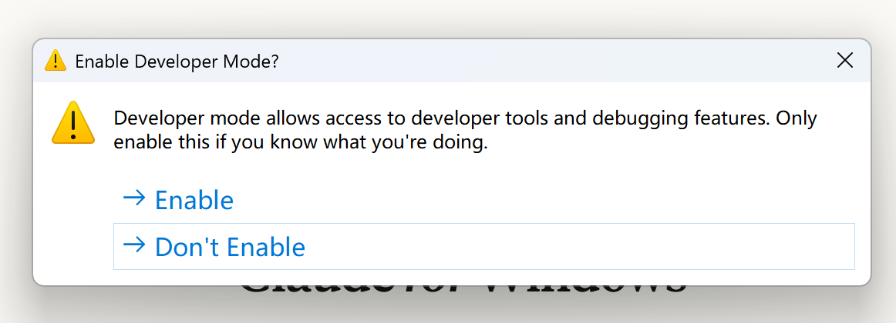
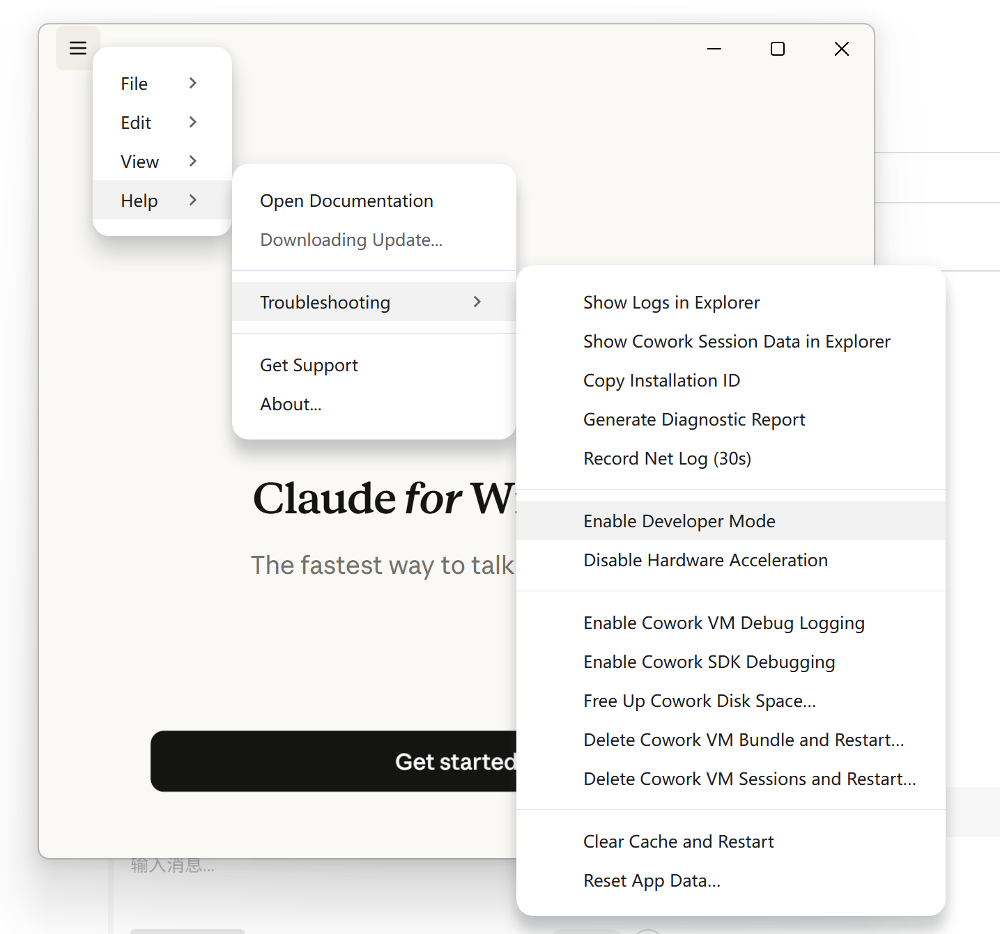
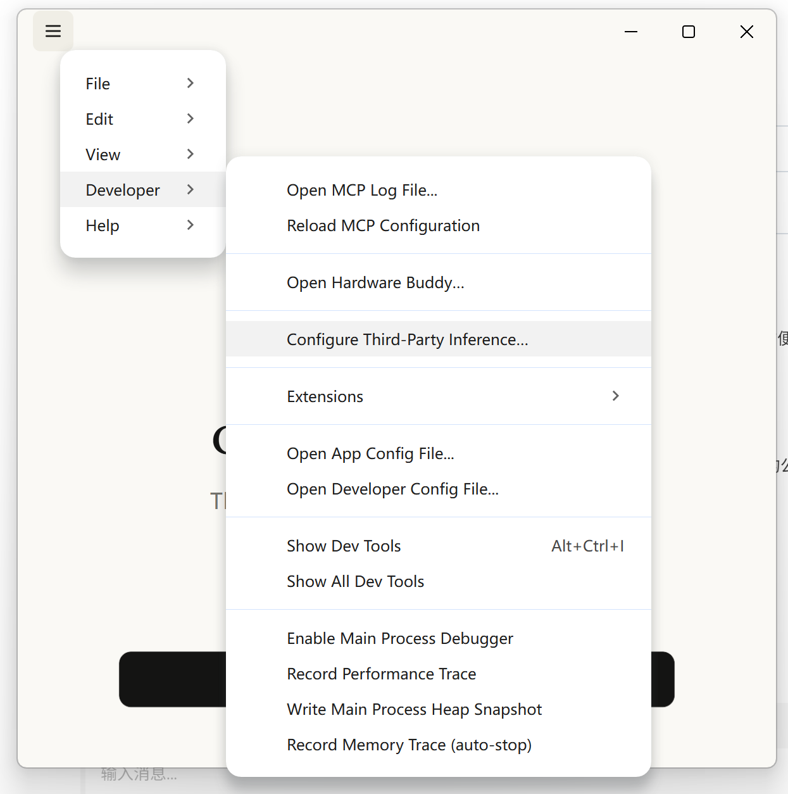
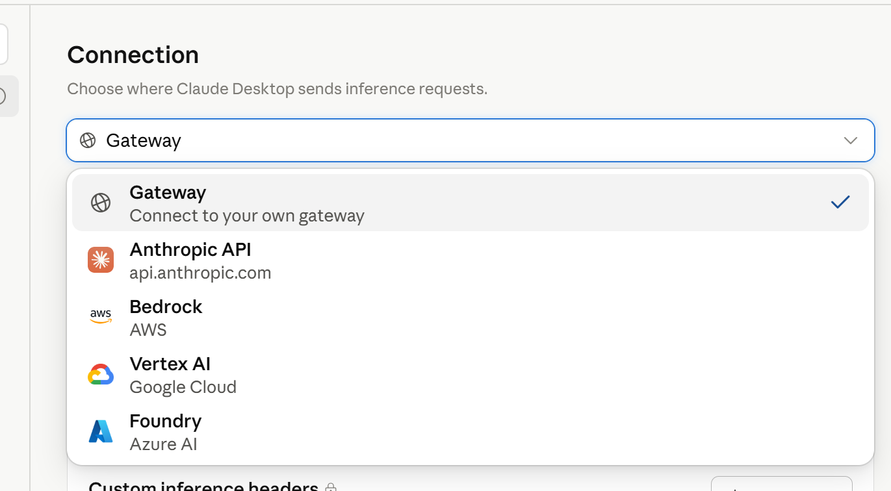
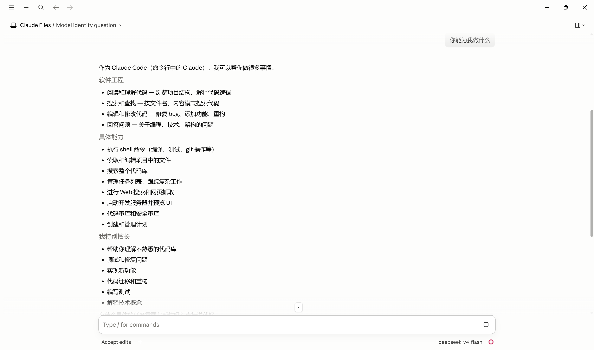
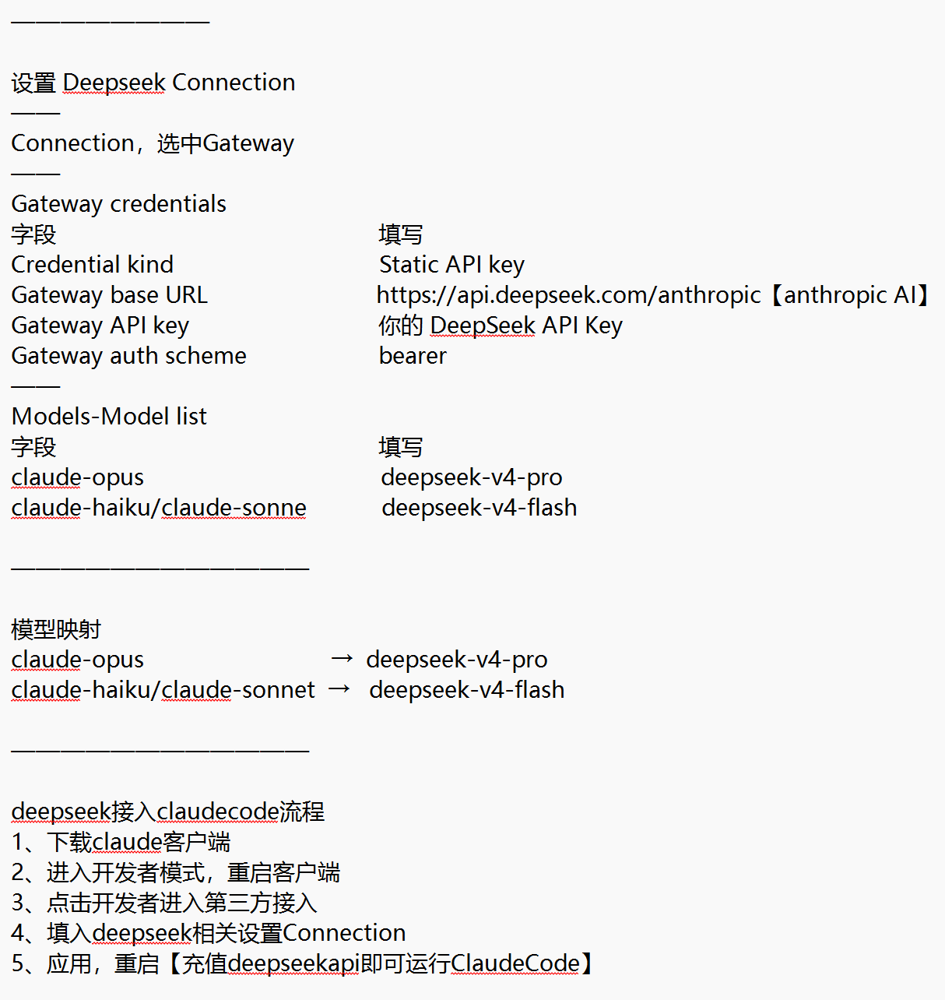

# 🧰 AI-BOX

AI 工具配置与技能仓库 — 一站式收集各种 AI 工具的接入指南、配置文件和使用技巧。

---

## 📦 当前内容

### 🚀 [DeepSeek 大模型接入 Claude Code 使用](claude-code-deepseek/SKILL.md)

**核心价值**：通过 DeepSeek 的 Anthropic 兼容 API，让 Claude Code 底层调用 DeepSeek V4 系列大模型，成本降低 **20-50 倍**，充 10 块钱够用 1-2 个月。

```
┌──────────────┐      Anthropic API 格式请求       ┌─────────────────────┐
│              │ ─────────────────────────────────▶ │                     │
│  Claude Code │                                     │  DeepSeek 兼容网关   │
│   (你的终端)  │ ◀───────────────────────────────── │  api.deepseek.com   │
│              │      Anthropic API 格式响应           │  /anthropic         │
└──────────────┘                                     └──────────┬──────────┘
                                                                │
                                                                ▼
                                                   ┌─────────────────────┐
                                                   │  DeepSeek 大模型     │
                                                   │  V4 Pro / V4 Flash   │
                                                   └─────────────────────┘
```

### 💰 成本对比

| | Anthropic 官方 (Sonnet) | DeepSeek V4 Pro | 节省 |
|---|---|---|---|
| 输入 / 百万 token | ~¥22 | ¥1 | **~22 倍** |
| 输出 / 百万 token | ~¥109 | ¥4 | **~27 倍** |
| 月费 (5M token) | ~¥330 | ~¥15 | **~22 倍** |

---

## 🔧 Claude Code 接入 DeepSeek 完整流程

### Step 1：获取 DeepSeek API Key + 充值


1. 登录 [platform.deepseek.com](https://platform.deepseek.com)
2. 进入 [API Keys](https://platform.deepseek.com/api_keys) → 创建 Key → **立刻复制保存**（关闭后不可查看）
3. 进入 [充值页面](https://platform.deepseek.com/top_up) → 最低充 ¥10（微信/支付宝）

### Step 2：进入 Claude Code 开发者模式





打开 Claude Code 桌面端 → 进入 Settings → 开启 **Developer Mode（开发者模式）** → 重启客户端。

### Step 3：选择第三方接入



在开发者设置中，选择 **Third-party Access（第三方接入）**。

### Step 4：配置 Gateway 连接




选择 **Gateway** 接入方式，填入以下信息：

| 字段 | 值 |
|------|-----|
| Connection Type | Gateway |
| Credential Kind | Static API Key |
| Gateway Base URL | `https://api.deepseek.com/anthropic` |
| Gateway API Key | `sk-你的DeepSeek-API-Key` |
| Gateway Auth Scheme | `bearer` |

**Models 映射（Model List）：**

| 左边填（Claude 模型名） | 右边填（DeepSeek 模型名） |
|---|---|
| `claude-opus-4-8` | `deepseek-v4-pro` |
| `claude-sonnet-4-6` | `deepseek-v4-pro` |
| `claude-haiku-4-5` | `deepseek-v4-flash` |

### Step 5：验证



重启 Claude Code，测试：
```bash
claude -p "用 Python 写一个 hello world 函数并调用它"
```
正常输出代码即配置成功！

---

### 📝 快速笔记



**口诀**：
1. 下载 Claude 客户端
2. 进入开发者模式，重启客户端
3. 点击开发者 → 第三方接入
4. 填入 DeepSeek 相关 Connection 设置
5. 应用、重启 → 充值 DeepSeek API 即可运行

---

## 📖 详细文档

完整的环境变量配置、Linux/macOS/Windows 命令、排错指南、功能兼容性矩阵，详见：

👉 [claude-code-deepseek/SKILL.md](claude-code-deepseek/SKILL.md)

涵盖内容：
- 背景原理与架构图
- DeepSeek 账号准备（注册、API Key、充值、计价）
- 环境变量配置（macOS / Linux / Windows / VSCode 四种方式）
- 模型映射策略（省钱 / 平衡 / 质量三档）
- 连通性验证（三重验证法）
- 排错指南（401 / 404 / 402 / 超时 / 截断 / 不生效）
- 功能兼容性矩阵
- 省钱最佳实践

---

## 🏗️ 为什么叫 AI-BOX

像一个工具箱，把各种 AI 工具的配置和经验装进去，随时取用。从 DeepSeek 接入指南起步，后续会陆续加入更多工具的配置指南。

---

## 🤝 贡献

欢迎 PR 添加新的 skill 或工具配置。格式参考 `claude-code-deepseek/SKILL.md`。

---

<p align="center">
  <b>省钱、好用、中文友好。</b><br>
  ⭐ Star this repo if it helps you!
</p>

